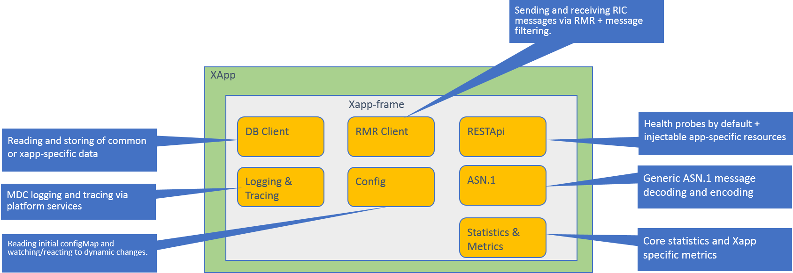

# XAPP-FRAME

## Introduction
**xapp-frame** is a simple framework for rapid development of RIC xapps, and supports various services essential for RIC xapps such as RESTful APIs, RMR (RIC Message Routing), logging, performance metrics and database backend services. It also provides configuration interface for reading, watching and populating config-map changes in K8S environment.

## Architecture



## Features and Components

* RESTful support
* Health check/probes (readiness and liveliness)
* Reading and watching config-map
* RMR messaging
* SDL
* Loggind and tracing
* Encoding and decoding of commonly used RIC ASN.1 messages
* And more to come

## Prerequisites
Make sure that following tools are properly installed and configured
* GO (golang) development and runtime tools
* MDCLOG (ricplt/com/log)
* RMR (ricplt/lib/rmr)
* DBAAS (redis-server)

## Quick Start

#### Below is a simple example xapp. For more information, see the sample code in the xapp/examples folder:
```go
package main

import "gerrit.o-ran-sc.org/r/ric-plt/xapp-frame/pkg/xapp"

type ExampleXapp struct {
}

func (m *ExampleXapp) Consume(rp *xapp.RMRParams) (err error) {
        xapp.Logger.Debug("Message received - type=%d len=%d", rp.Mtype, rp.PayloadLen)

        xapp.Sdl.Store("myKey", rp.Payload)
        xapp.Rmr.Send(r)
        return nil
}

func main() {
       xapp.Run(ExampleXapp{})
}
```
#### Building and running the example xapp

    git clone https://gerrit.o-ran-sc.org/r/ric-plt/xapp-frame
    cd xapp-frame

#### To generate an executable binary for our sample xApp application, run the following command:

    GO111MODULE=on GO_ENABLED=0 GOOS=linux go build -a -installsuffix cgo -o example-xapp examples/example-xapp.go

#### To run the generated executable binary locally, run the following command:

    RMR_SEED_RT=examples/config/uta_rtg.rt ./example_xapp -f examples/config/config-file.json

Congratulations! You've just built your first **xapp** application.

## API LIST
#### Logging APIs
 * SetLevel(level int)
  ```
  Sets logging level to given "level". Level can be 1=ERROR, 2=WARN, 3=INFO, 4=DEBUG
  ```
 * SetMdc(key string, value string)
  ```
  Sets the application MDC to given string. The MDC will be visible in the logs
  ```
 * Error(pattern string, args ...interface{}).
  ```
  Writes an error log. Other possible function are: Warn, Info and Debug
  ```

#### Config APIs
 * AddConfigChangeListener(f ConfigChangeCB)
  ```
  Injects an application callback function that is called when config change occurs
  ```
 * GetString(key string) string
  ```
  Returns the value associated with the key as a string. Other possible functions are: GetInt, GetBool and GetStringSlice
  ```

#### Metrics APIs
 * RegisterCounterGroup(opts []CounterOpts, subsytem string) (c map[string]Counter)
  ```
  Creates a new 'Counter' vector based on the provided CounterOpts and partitioned by the given label names.
  ```
 * RegisterGaugeGroup(opts []CounterOpts, subsytem string) (c map[string]Gauge)
  ```
  Creates a new 'Gauge' vector based on the provided CounterOpts and partitioned by the given label names.
  ```

#### RMR-client APIs
 * IsReady() bool
  ```
  Indicates whether RMR is ready or not
  ```
 * SetReadyCB(cb ReadyCB, params interface{})
  ```
  Injects a callback function that is called when RMR is ready
  ```
 * Allocate() *C.rmr_mbuf_t
  ```
  Allocates and return RMR message buffer
  ```
 * Free(mbuf *C.rmr_mbuf_t)
  ```
  De-allocates a RMR message buffer previously allocated with 'Allocate'
  ```
 * SendMsg(params *RMRParams)
  ```
  Sends RMR message based on the given RMR parameters
  ```
 * SendRts(params *RMRParams)
  ```
  Sends 'rts' RMR message based on the given RMR parameters
  ```

#### REST APIs
 * InjectRoute(url string, handler http.HandlerFunc, method string) *mux.Route
  ```
  Registers a given URL and corresponding handler, which will be called when incoming request matches with the URL
  ```
 * InjectQueryRoute(url string, h http.HandlerFunc, m string, q ...string) *mux.Route
  ```
  Registers an inquiry URL and corresponding handler, which will be called when incoming request matches with the URL
  ```
 * InjectStatusCb(f StatusCb)
  ```
  Injects a callback function, which is called during K8s aliveness probe
  ```

#### SDL APIs
 * Store(key string, value interface{}) (err error)
  ```
  Store writes the value of a key to SDL. MStore writes multiple key-value pairs atomically
  ```
 * Read(key string) (value map[string]interface{}, err error)
  ```
  Reads the value of a key from SDL. MRead reads multiple keys atomically
  ```

#### API Usage and Examples
* Setting logging level and writing to log
    ```
    xapp.Logger.SetLevel(4)
    xapp.Logger.Info("Status inquiry ...")
    ```
* Storing key-value data to SDL
    ```
    xapp.Sdl.Store("myKey", payload)
    ```
* Sending RMR messages
    ```
    mid := Rmr.GetRicMessageId("RIC_SUB_RESP")
    xapp.Rmr.Send(mid, 1234, len, payload)
    ```
* Injecting REST API resources (URL)
    ```
    xapp.Resource.InjectRoute("/ric/v1/health/stat", statisticsHandler, "GET")
    Resource.InjectQueryRoute("/ric/v1/user", handler, "GET", "foo", "bar", "id", "mykey")
    ```

* Metrics: registering couple of counters
    ```
    metrics := []xapp.CounterOpts{
		{Name: "RICIndicationsRx", Help: "The total number of RIC inidcation events received"},
		{Name: "RICExampleMessageRx", Help: "The total number of RIC example messages received"},
	}
    xapp.Metric.RegisterCounterGroup(metrics, "MyXApp")

    // Use curl-command to get metrics
    curl http://localhost:8080/ric/v1/metrics
    ```

## Running unit tests
  Unit tests of xApp-framework can be run as following:
  ```
  make test
  ```

## Documentation

## Community

## License
This project is licensed under the Apache License 2.0 - see the [LICENSE.md](LICENSE.md) file for details

